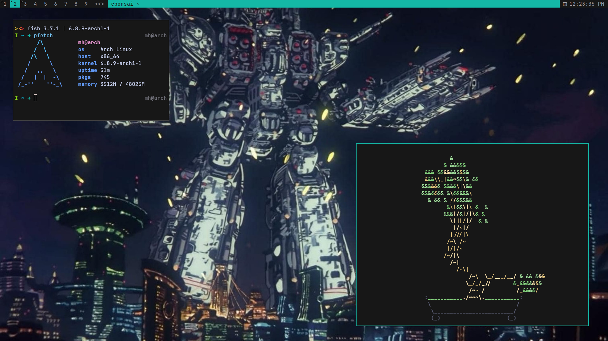

# dwm

this is my fork of dwm

also see:

- my config for `slstatus`: https://github.com/maxhu08/slstatus
- my config for `dwmblocks` [OUTDATED]: https://github.com/maxhu08/dwmblocks
- my config for `st`: https://github.com/maxhu08/st
- my config for `slock`: https://github.com/maxhu08/slock

## patches

patches included so far:

- `stacker` https://dwm.suckless.org/patches/stacker
  - makes it so that MOD+J & MOD+K moves windows up & down the stack
- `vanitygaps` https://dwm.suckless.org/patches/vanitygaps
  - provides adjustable gaps with keybinds and more layouts
- `setborderpx` https://dwm.suckless.org/patches/setborderpx
  - provides adjustable borderpx with keybinds
- `tiledmove` https://dwm.suckless.org/patches/tiledmove
  - makes it so MOD+lmb allows windows to stay tiled while moving them
- `resizehere` https://dwm.suckless.org/patches/resizehere
  - prevents mouse from warping to bottom right corner when resizing window
- `dragmfact` https://dwm.suckless.org/patches/dragmfact
  - makes it so MOD+rmb resizes mfact
- `statusallmons` https://dwm.suckless.org/patches/statusallmons
  - makes it so that status bar gets updated on all monitors instead of just the focused one
- `resetlayout` https://dwm.suckless.org/patches/resetlayout
  - makes it so mfact goes back to default when only one client is visible

## quick-start

to get started run these commands:

```
git clone https://github.com/maxhu08/dwm
cd dwm
sudo make clean install
```

then add this to your `~/.xinitrc`

```
exec dwm
```

## showcase





